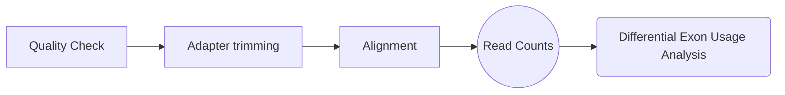

# DexSeq Workflow
The DexSeq workflow will enable you to estimate the differential exon usage in comparative RNA-Seq experiments.
>By _differential exon usage_ (DEU), we mean changes in the relative usage of exons caused by the experimental condition. The relative usage of an exon is defined as: 


##### General Idea: 
For each exon (or part of an exon) and each sample, we count how many reads map to this exon and how many reads map to any of the other exons of the same gene. We consider the ratio of these two counts, and how it changes across conditions, to infer changes in the relative exon usage.

Read more about the DEXSeq algorithm from it's [manual](https://bioconductor.org/packages/release/bioc/vignettes/DEXSeq/inst/doc/DEXSeq.html).

## Workflow


1. **Quality check of RNASeq data**
The raw fastqc must be subjected to Quality check using `fastqc` and `multiqc` tools:
```bash
## Downloading miniconda
wget https://repo.anaconda.com/miniconda/Miniconda3-latest-Linux-x86_64.sh && chmod +x Miniconda3-latest-Linux-x86_64.sh && ./Miniconda3-latest-Linux-x86_64.sh

#press yes for all and restart the terminal once miniconda is installed
```
Save the code below to setup the environment for DEXSeq workflow.
You can name the script as `dexseq_setup.sh`

To run it type ./dexseq_setup.sh environment_name
where environment name could be anything like `dexseq`
```bash
###	This block checks if you have conda installed & activated ###
conda -V > /dev/null
if [ $? -eq 0 ]; then
        echo "$(conda -V)  is installed!"
else
    echo "error: miniconda Package  is NOT installed! Please install and activate it first"
        exit 1
fi

###########################################################
env_name=$1
###################     Setting up the environment      ################################
##	preserve the sequence of the tools, comment the rsem if you choose to use STAR or vice versa

conda create -y -n $env_name
conda install --name $env_name -c bioconda -y fastqc
conda install --name $env_name -c bioconda -c conda-forge -y multiqc
conda install --name $env_name -c r -y r-essentials
conda install --name $env_name -c bioconda -y rsem
conda install --name $env_name -c bioconda -y star

echo 'if (!requireNamespace("BiocManager", quietly = TRUE))
    install.packages("BiocManager")
    BiocManager::install("DEXSeq", dependencies = TRUE)
    library(DEXSeq)
    pythonScriptsDir = system.file( "python_scripts", package="DEXSeq" )
    write.csv(pythonScriptsDir, file = "Dexseq_path.csv")
    exit
    ' > dexseq_prep.R
Rscript dexseq_prep.R
```

 - Running fastqc

`fastqc -o QC_results/ /path/to/fastq/files*.gz 2> fastqc.log`

The 2> will redirect the log that's printed on the screen into a fastqc.log log file.

You can also submit the fastqc command as a job on your system using `nohup`
eg:
`nohup fastqc -o QC_results/ /path/to/fastq/files*.gz 2> /path/to/store/log/fastqc.log &`

nohup will detach your job from the terminal and `&` will run it in the background. To confirm if job is running, type `ps wx`

Once the fastqc finishes, run multiqc in the directory where fastqc results are stored. Multiqc facilitates to combine all the fastqc results in a single browsable html page.
```bash
cd QC_results/
```
To interpret the multiqc result, follow [this](https://hbctraining.github.io/Intro-to-rnaseq-hpc-O2/lessons/02_assessing_quality.html) tutorial.

If the data quality is good and the reads are free from adapters, you can skip the Adapter/Quality trimming step.

#### Notes:

> In case if you find difficulty installing packages in R, try to
> install the packages in the sequence in which they occurs in the
> warning.

 2.  **Alignment**
For alignment of reads to reference genome, we preferentially use STAR aligner, that performs split alignment.  Read more on sequence alignment theory from [here](https://github.com/hbctraining/Intro-to-rnaseq-hpc-O2/blob/master/lectures/Sequence_alignment.pdf). To know more about the STAR aligner algorithm, refer to [this blog](https://hbctraining.github.io/Intro-to-rnaseq-hpc-O2/lessons/03_alignment.html). This includes two steps:
- Generating genome index

The basic options to  **generate genome indices**  using STAR are as follows:

-   `--runThreadN`: number of threads
-   `--runMode`: genomeGenerate mode
-   `--genomeDir`: /path/to/store/genome_indices
-   `--genomeFastaFiles`: /path/to/FASTA_file
-   `--sjdbGTFfile`: /path/to/GTF_file
-   `--sjdbOverhang`: readlength -1

>_NOTE:_ In case of reads of varying length (mostly happens when you performed adapter/quality trimming ), the ideal value for `--sjdbOverhang` is max(ReadLength)-1. In most cases, the default value of 100 will work similarly to the ideal value.
```bash
STAR --runThreadN 6 \
--runMode genomeGenerate \
--genomeDir /path/to/store/genome_indices/hg38 \
--genomeFastaFiles /path/to/FASTA_file/Homo_sapiens.GRCh38.fa \
--sjdbGTFfile /path/to/genome_feature_file_i.e_gtf/Homo_sapiens.GRCh38.92.gtf \
--sjdbOverhang 99
```
You can get these files from GENCODE. Try using a stable assembly as available [here](https://www.gencodegenes.org/human/release_21.html). Download the `Genome sequence (GRCh38)` from fasta file section and gtf file `Comprehensive gene annotation, ALL`. Try to keep these file same for the study throughout.

In case if you plan using RSEM, which rescues multimapping reads too using Expectation Maximization Algorithm use the following steps:
```
rsem-prepare-reference --gtf /path to/gencode.v33.annotation.gtf \
--star --star-path ~/anaconda3/bin/ /path to/GRCh38.primary_assembly.genome.fa \
/path/to/output_directory/name_of_output_file 2> rsem.stderr
```
- Aligning reads using STAR / RSEM
The basic options for aligning reads to the genome using STAR are:

-   `--runThreadN`: number of threads / cores
-   `--readFilesIn`: /path/to/FASTQ_file
-   `--genomeDir`: /path/to/genome_indices_directory
-   `--outFileNamePrefix`: prefix for all output files

Listed below are additional parameters that we will use in our command:

-   `--outSAMtype`: output filetype (SAM default)
-   `--outSAMunmapped`: what to do with unmapped reads

> **NOTE:**  Default filtering is applied in which the maximum number of multiple alignments allowed for a read is set to 10. If a read exceeds this number there is no alignment output. To change the default you can use  `--outFilterMultimapNmax`, but for this lesson we will leave it as default. Also, note that “**STAR’s default parameters are optimized for mammalian genomes.**  Other species may require significant modifications of some alignment parameters; in particular, the maximum and minimum intron sizes have to be reduced for organisms with smaller introns” [[1](http://bioinformatics.oxfordjournals.org/content/early/2012/10/25/bioinformatics.bts635.full.pdf+html)].

```bash
STAR --genomeDir /path to/star/indexes/ \
--runThreadN 6 \
--readFilesCommand zcat \
--readFilesIn path/sample_R1.fastq.gz sample_R2.fastq.gz \
--outFileNamePrefix ../results/STAR/sample \
--outSAMtype BAM SortedByCoordinate \
--outSAMunmapped Within \
--outSAMattributes Standard \
2> /path/to_save_log/sample_prefix.log
```
Using RSEM
While using RSEM, try to information about the strandedness of the RNASeq library, like if the sense or antisense library was produced and change the option accordingly. RSEM uses this option essentially to produce a read count file containing the TPM & FPKM values. You will also be requiring the strandedness information while using `HTSeq`.
```bash
rsem-calculate-expression --star-output-genome-bam \
--strandedness reverse \
-p 32 \
--calc-pme --calc-ci --keep-intermediate-files \
--append-names --sort-bam-by-coordinate 
--paired-end --estimate-rspd --star \
--star-path /location/to/star/ \
/path/to/samples/Contr1_S15_L004_R1_p.fastq /path/to/samples/Contr1_S15_L004_R2_p.fastq \
/path/to/index/directory \
/path/to/output/Contr1_S15_L004(prefix to be use for output) \
2> /path/to_save_log/Contr1_S15_L004.log
```
- `--output-genome-bam` Generate a BAM file, 'sample_name.genome.bam', with alignments mapped to genomic coordinates and annotated with their posterior probabilities. In addition, RSEM will call samtools (included in RSEM package) to sort and index the bam file. `sample_name.genome.sorted.bam` and `sample_name.genome.sorted.bam.bai` will be generated. (Default: off) 
- `--star-output-genome-bam` (STAR parameter) Save the BAM file from STAR alignment under genomic coordinate to `sample_name.STAR.genome.bam`. This file is NOT sorted by genomic coordinate. In this file, according to STAR's manual, 'paired ends of an alignment are always adjacent, and multiple alignments of a read are adjacent as well. (Default: off) 
- `--strandedness <none|forward|reverse>` This option defines the strandedness of the RNA-Seq reads. It recognizes three values: `none`, `forward`, and `reverse`. `none` refers to non-strand-specific protocols. `forward` means all (upstream) reads are derived from the forward strand. `reverse` means all (upstream) reads are derived from the reverse strand. If `forward`/`reverse` is set, the `--norc`/`--nofw` Bowtie/Bowtie 2 option will also be enabled to avoid aligning reads to the opposite strand. For Illumina TruSeq Stranded protocols, please use `reverse`. (Default: 'none') 
- `--paired-end` Input reads are paired-end reads. (Default: off) 
- `--calc-pme` Run RSEM's collapsed Gibbs sampler to calculate posterior mean estimates. (Default: off) 
- `--estimate-rspd` Set this option if you want to estimate the read start position distribution (RSPD) from data. Otherwise, RSEM will use a uniform RSPD. (Default: off) 
- `--calc-ci` Calculate 95% credibility intervals and posterior mean estimates. The credibility level can be changed by setting 
- `--keep-intermediate-files` Keep temporary files generated by RSEM. RSEM creates a temporary directory, `sample_name.temp`, into which it puts all intermediate output files. If this directory already exists, RSEM overwrites all files generated by previous RSEM runs inside of it. By default, after RSEM finishes, the temporary directory is deleted. Set this option to prevent the deletion of this directory and the intermediate files inside of it. (Default: off) 
- `--append-names` If gene_name/transcript_name is available, append it to the end of gene_id/transcript_id (separated by '_') in files 'sample_name.isoforms.results' and 'sample_name.genes.results'. (Default: off) 
- `--sort-bam-by-coordinate` Sort RSEM generated transcript and genome BAM files by coordinates and build associated indices. (Default: off)

RSEM uses ENCODE3 pipeline golden standard parameters. Therefore, I prefer using RSEM besides STAR.
#### Rationale of using above parameters

 - `--estimate-rspd` option should be specified so that RSEM can estimate a read start position distribution (RSPD), which may allow for more
   accurate abundance estimates. So just to take care of biases if any.
   
 - Check with the experimentalists which kit was used for library prepation and which protocol was followed. If a strand-specific protocol is used, the `--strand-specific` option should be specified. Otherwise, it is assumed that a read has equal probability of coming from the sense or antisense directions. Also, you might end ub getting more reads in Ambiguous category. We used Illumina TrueSeq Standard Protocol which gives majority of the transcripts from the reverse strand.

> In addition to computing ML abundance estimates, RSEM can also use a Bayesian version of its model to produce a PME and 95% CI for the abundance of each gene and isoform. These values are computed by Gibbs sampling (see Methods) and can be obtained by specifying the --calc-ci option. The 95% CIs are valuable for assessing differential expression across samples, particularly for repetitive genes or isoforms because the CIs capture uncertainty due to both random sampling effects and read mapping ambiguity. **We recommend using the CIs in combination with the results of differential expression tools, which currently do not take into account variance from multiread allocation.** The PME values may be used in lieu of the ML estimates as they are very similar, but have the convenient property of generally being contained within the 95% CIs, which is sometimes not the case for small ML estimates.

Keep-intermediate files will help store alignment stats generated by star which otherwise is discarded by RSEM. The Log.final.out file in sample.tmp folder help determine the quality of your data. You can also get those stats from .cnt files. See [here](https://groups.google.com/forum/#!topic/rsem-users/usmPKgsC5LU) and [here](https://github.com/deweylab/RSEM/blob/master/cnt_file_description.txt) for reading .cnt files.

#### ENCODE3 pipeline parameters used by RSEM
                       " --genomeDir $star_genome_path " .
                       ' --outSAMunmapped Within ' .
                       ' --outFilterType BySJout ' .
                       ' --outSAMattributes NH HI AS NM MD ' .
                       ' --outFilterMultimapNmax 20 ' .
                       ' --outFilterMismatchNmax 999 ' .
                       ' --outFilterMismatchNoverLmax 0.04 ' .
                       ' --alignIntronMin 20 ' .
                       ' --alignIntronMax 1000000 ' .
                       ' --alignMatesGapMax 1000000 ' .
                       ' --alignSJoverhangMin 8 ' .
                       ' --alignSJDBoverhangMin 1 ' .
                       ' --sjdbScore 1 ' .
                       " --runThreadN $nThreads " .
                       ##

                       ## different than ENCODE3 pipeline
                       ## do not allow using shared memory
                       ' --genomeLoad NoSharedMemory ' .
                       ##

                       ## different than ENCODE3 pipeline, which sorts output BAM
                       ## no need to do it here to save time and memory
                       ' --outSAMtype BAM Unsorted ' .
                       ##

                       ## unlike ENCODE3, we don't output bedGraph files

                       ' --quantMode TranscriptomeSAM '.
                       ' --outSAMheaderHD \@HD VN:1.4 SO:unsorted '.

                       ## define output file prefix
                       " --outFileNamePrefix $imdName ";

3. **Counting Reads**

```r
##locating the python file of DEXSeq
#	open R
R
## Load DEXSeq
library(DEXSeq)
##store path of python script in pythonScriptsDir directory
pythonScriptsDir = system.file( "python_scripts", package="DEXSeq" ) 
list.files(pythonScriptsDir)
#or
system.file( "python_scripts", package="DEXSeq", mustWork=TRUE )
```
Once path of scripts is clear

```bash
python /path/to/dexseq_prepare_annotation.py -r no /path/to/gencode.v33.annotation.gtf DEXSeq.gff 2> gff.stderr
```
>**NOTE**: The python scripts of DEXSeq are written in python2.7 and will simply fail if run in default environment. It's better to create a conda environmanet with python 2.7. to overcome the syntax error. While preparing the DEXSeq compatible gff, we would like to generate nonoverlapping aggregate gtf. For details refer  [here](http://seqanswers.com/forums/showthread.php?t=41551).

>In the process of forming the counting bins, the script might come across overlapping genes. If two genes on the same strand are found with an exon of the first gene overlapping with an exon of the second gene, the script’s default behaviour is to combine the genes into a single “aggregate gene” which is subsequently referred to with the IDs of the individual genes, joined by a plus (‘+’) sign. If you do not like this behaviour, you can disable aggregation with the option `-r no`. Without aggregation, exons that overlap with other exons from different genes are simply skipped.

DEXSeq didn't work with BAM im my experience though they claim it can. Since the packages are updated always try passing in BAM first and if thrown an error try providing a SAM file (use samtools view subcommand for that)

```bash
python dexseq_count.py -p yes -a 10 -f bam -r pos DEXSeq.gff sample.bam sample.fb.txt 2> sample.stderr

#or with Sorted SAM only. Sort by position i.e coordinates

python /path/to/dexseq_count.py -p yes -r pos -s reverse -a 10 DEXSeq.gff sample.sam sample.Readcounts.txt 2> sample.stderr
```
Options used are:
- `-p yes` If your data is from a paired-end sequencing run
- `-r pos` Coordinate sorted
- `-s reverse` for antisense strand
- `-a 10` the minimum alignment quality (as given in the fifth column of the SAM file). All reads with a lower quality than specified (with default -a 10) are skipped.

Read more about options [here](https://bioconductor.org/packages/release/bioc/vignettes/DEXSeq/inst/doc/DEXSeq.html#3_Counting_reads)

Always try to retain the BAM file.

4. **Differential Exon Usage Analysis:**
Use Rstudio to run this script

For design formula: [example 1](https://support.bioconductor.org/p/59532/),  [example 2](https://support.bioconductor.org/p/109853/)
```r
##Loading Library
library( "DEXSeq" )


#####	Samplesheet for DEXSeq analysis is present in the working directory	######
####	Reading sample table and viewing. Including the rownames will helpe while viewing annotations
sampleTable <- read.csv("samplesheet.csv", header = T, sep = ",",row.names = c( "control1","test1","control2","test2","control3","test3"))
sampleTable
countFiles <- as.character(sampleTable$filePath)

#             name                                     filePath group condition
#control1 control1     ./S1_S10_L004.STAR.genome.Readcounts.txt  Rep1   control
#test1       test1     ./S2_S11_L004.STAR.genome.Readcounts.txt  Rep1  silenced
#control2 control2 ./Contr1_S15_L004.STAR.genome.Readcounts.txt  Rep2   control
#test2       test2  ./TRF22_S13_L004.STAR.genome.Readcounts.txt  Rep2  silenced
#control3 control3  ./Contr_S14_L004.STAR.genome.Readcounts.txt  Rep3   control
#test3       test3  ./TRF24_S12_L004.STAR.genome.Readcounts.txt  Rep3  silenced

#basename(countFiles)
#Storing my gff file
flattenedFile = list.files(pattern="gff$", full.names=TRUE)
#basename(flattenedFile)

##Creating design formula 
#samples represent samples
#condition is the factor of experimental conditions (treated vs non-treated or silenced vs wild type)
#condition:exon is to study effect of condition on exon usage

##Structuring data and meta data
dxd = DEXSeqDataSetFromHTSeq(countFiles,sampleData=sampleTable,design= ~ sample + exon + condition:exon,flattenedfile=flattenedFile )

#Subsetting the analysis for TERF2. My csv only contains TERF2 ENSEMBLE ID because that's my gene of interest. In case if you want to do it for all genes skip this step 
genesForSubset = read.table( 
  file.path("geneID.csv"), 
  stringsAsFactors=FALSE)[[1]]
dxd = dxd[geneIDs( dxd ) %in% genesForSubset,]

##Exploring the dataframe
#information regarding each column of the DEXSeqDataSet, is specified: colData(dxd)
#access the first 5 rows from the count data by doing: head( counts(dxd), 5 ). Note that the number of columns is 12, the first six (we have six samples) corresponding to the number of reads mapping to out exonic regions and the last six correspond to the sum of the counts mapping to the rest of the exons from the same gene on each sample.

#                         [,1] [,2] [,3] [,4] [,5] [,6] [,7] [,8] [,9] [,10] [,11] [,12]
#ENSG00000132604.11:E001  191  149  168  121  149  151 2240 1564 1790  1242  2323  1715
#ENSG00000132604.11:E002   50   45   38   36   47   44 2381 1668 1920  1327  2425  1822
#ENSG00000132604.11:E003  207  175  157  134  198  151 2224 1538 1801  1229  2274  1715
#ENSG00000132604.11:E004   95   60   79   47  108   69 2336 1653 1879  1316  2364  1797
#ENSG00000132604.11:E005    1    3    5    3    4    3 2430 1710 1953  1360  2468  1863

#access only the first five rows from the count belonging to the exonic regions (‘this’) (without showing the sum of counts from the rest of the exons from the same gene
#head( featureCounts(dxd), 5 )

#                         control1 test1 control2 test2 control3 test3
#ENSG00000132604.11:E001      191   149      168   121      149   151
#ENSG00000132604.11:E002       50    45       38    36       47    44
#ENSG00000132604.11:E003      207   175      157   134      198   151
#ENSG00000132604.11:E004       95    60       79    47      108    69
#ENSG00000132604.11:E005        1     3        5     3        4     3

#sampleAnnotation( dxd )
#head( featureCounts(dxd), 5 )

#Normalisation
dxd = estimateSizeFactors( dxd )

#Dispersion estimation: to estimate the variability of the data. This is necessary to be able to distinguish technical and biological variation (noise) from real effects on exon usage due to the different conditions.
#since we have single gene Dispersion  trend will not be captured buy the the estimateDispersion function 

#This step might take long time in case if you do it for all genes. You would then want to use BPPARAM = MulticoreParam(12) to run it parallely. Uncomment the code below to use that
#BPPARAM = MulticoreParam(12)
#dxd = estimateDispersions( dxd, BPPARAM=BPPARAM )
dxd = estimateDispersions( dxd )
plotDispEsts( dxd )
#saving the dataset
save(dxd, file = file.path(".", "TERF2DEXSeqDataSet.RData"))

#Testing for differential exon usage
dxd = testForDEU( dxd )

#relative exon usage fold changes.
dxd = estimateExonFoldChanges( dxd, fitExpToVar="condition") #applying log2(x+ 1) instead of vst because Dispersion function was not parametric
dxr1 = DEXSeqResults( dxd )
#dxr1
#mcols(dxr1)$description

#Check how many exonic regions are significant with a false discovery rate of 10%:
table ( dxr1$padj < 0.1 )
#FALSE 
#34 
#At 20% i.e 0.2 value
#FALSE  TRUE 
#26     8 

# To check how many genes are affected. In our case since we have one gene this isn't required
#table ( tapply( dxr1$padj < 0.1, dxr1$groupID, any ) )
plotMA( dxr1, cex=0.8 )
plotMA( dxr1, cex=0.8, alpha = 0.2 )# adjusted p-values

######	Estimating Batch Effect on Exon Expression	#####
## Here we wish to see if the exon usage is affected by exon condition which included harvesting cells at a gap of one week and effect of other unknown factors that could have influenced a control-case (say Rep1)
formulaReducedModel =  ~ sample + exon + group:exon
formulaFullModel    =  ~ sample + exon + group:exon + condition:exon

dxd = estimateDispersions( dxd, formula = formulaFullModel )
#you had estimated dispersions, replacing these
#-- note: fitType='parametric', but the dispersion trend was not well captured by the
#function: y = a/x + b, and a local regression fit was automatically substituted.
#specify fitType='local' or 'mean' to avoid this message next time.
#Warning message:
#  In lfproc(x, y, weights = weights, cens = cens, base = base, geth = geth,  :
#              Estimated rdf < 1.0; not estimating variance
#Seems, the software cannot find parameters a and b to fit the dispersion over mean trend using that formula. The better the prediction, the less error there is in that prediction. 
#A PRE statistic takes values between 0 and 1. 0 means no reduction in error, 1 means that there is perfect prediction—the error is completely eliminated


dxd = testForDEU( dxd, reducedModel = formulaReducedModel, fullModel = formulaFullModel )
dxr2 = DEXSeqResults( dxd )
table( dxr2$padj < 0.1 )
table( before = dxr1$padj < 0.1, now = dxr2$padj < 0.1 )
table( before = dxr1$padj < 0.2, now = dxr2$padj < 0.2 )


#Visualization
plotDEXSeq( dxr2, "ENSG00000132604.11", legend=TRUE, cex.axis=1.2, cex=1.3, lwd=2 )
## View Transcripts. DEXSeq is designed to find changes in relative exon usage, i.e., changes in the expression of individual exons that are not simply the consequence of overall up- or down-regulation of the gene.
library(grid, lib.loc = "C:/Program Files/R/R-3.6.2/library")
png("test.png", width = 10, height = 9, units = 'in', res = 700)
#After correction for Passages (cell harvasted at different time points, referring to the group column )
plotDEXSeq( dxr2, "ENSG00000132604.11", displayTranscripts=TRUE, expression=FALSE, splicing=TRUE,legend=TRUE, cex.axis=1.2, cex=1.3, lwd=2 )
dev.off()

#DEXSeqHTML( dxr2, FDR=0.1, path=".",file="testForDEU.html", color=c("#FF000080", "#0000FF80") )

#Before correction for passages (cell harvasted at different time points, referring to the group column )
plotDEXSeq( dxr1, "ENSG00000132604.11", expression=FALSE, splicing=TRUE,legend=TRUE, cex.axis=1.2, cex=1.3, lwd=2,FDR=0.2 )
```
